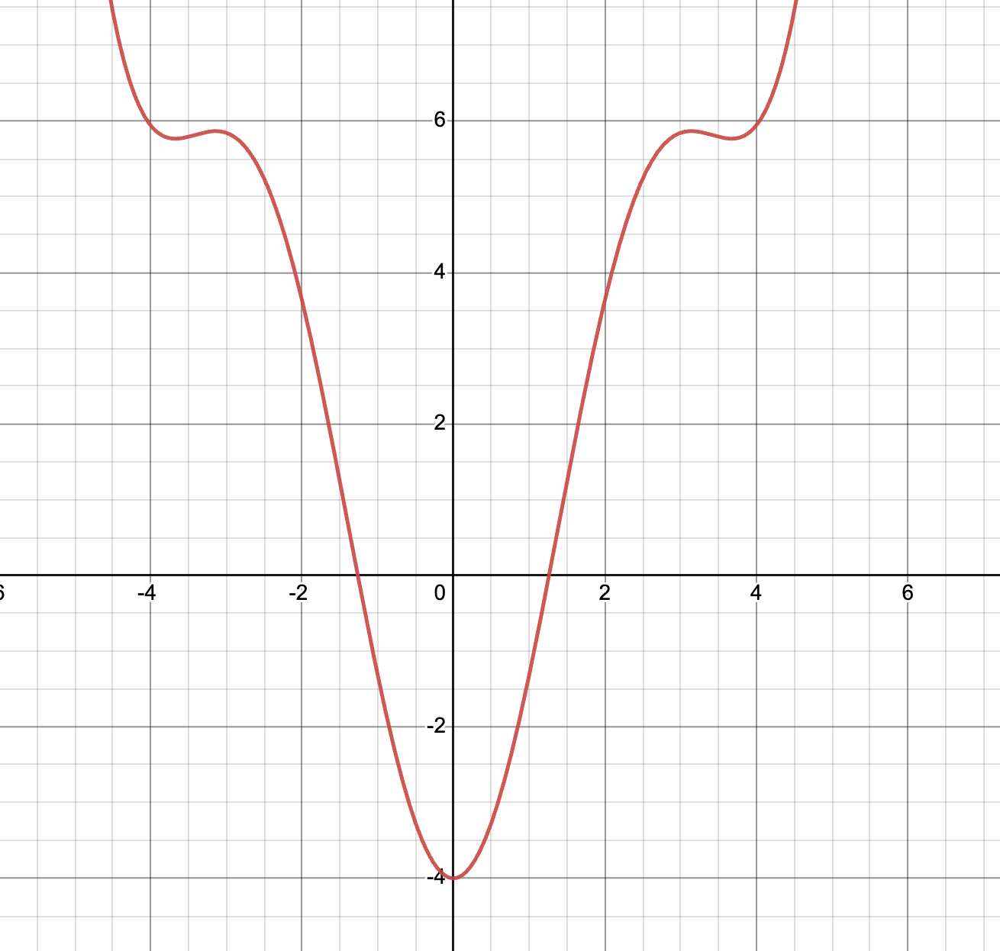

# Метод Ньютона

## Одномерный метод Ньютона

### ***Теорема Лагранжа о конечных приращениях***

> Пусть функция $f(x)$ дифференцируема в открытом промежутке $(a, b)$ и сохраняет непрерывность на концах этого промежутка.
> Тогда существует такая точка $c \in (a, b)$, что $$f'(c) = \frac{f(b) - f(a)}{b - a}$$

Пусть задана функция $f : X \subseteq  \mathbb{R}  \rightarrow  \mathbb{R}$, имеющая нуль в точке $x^{⋆}$. 
Тогда $$\forall x \in X \looparrowright f(x) - f(x^{⋆}) = f'(\xi)(x-x^{⋆})$$

Так как $f(x^{⋆}) = 0 ⇒ \forall x \in X ↬ f(x) = f'(ξ)(x-x^{⋆})$ 
$$x^{⋆} = x - \frac{f(x)}{f'(\xi)}$$

Выполним интервализацию формулы
$$x^{⋆} \in x - \frac{f(x)}{f'(\textbf{X})},$$
если $0 \notin f'(\textbf{X})$
 
Введём понятие интервального оператора Ньютона
$\mathcal{N}: \mathbb{IR} \times \mathbb{R} → ℝ$
$$\mathcal{N}(\textbf{X}, x) := x - \frac{f(x)}{f'(\textbf{X})}$$
> #### Важное замечание
> $\forall x \in X: f(x) = 0 ⇒ x \in \mathcal{N}(x, \textbf{X})$ (*в силу монотонности по включению*)

 
Будем уточнять интервал решения следующим образом
    $$\textbf{X} \cap \mathcal{N}(x, \textbf{X})$$

Общий вид итерационного процесса:
$$\textbf{X}^{(k+1)} ← \textbf{X}^{(k)}\cap \mathcal{N}(x, \textbf{X})$$

## Пример
 

Будем искать нули функции $$f(x) =  x^2 + 2x\sin{x}  -4$$
 

