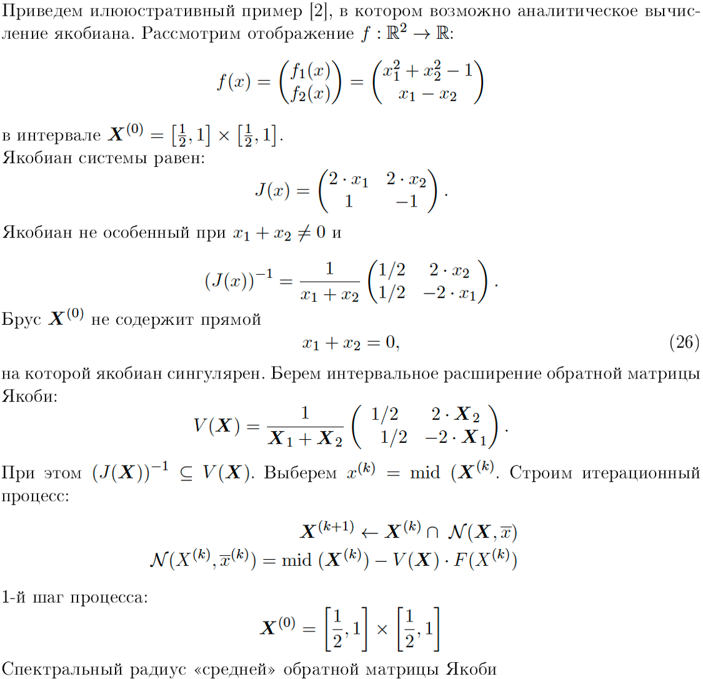

# Метод Ньютона

[//]: # ([Функция №1]&#40;#функция-1&#41;)

[//]: # ()
[//]: # ([Функция №2]&#40;#функция-2&#41;)

## Архитектура проекта

[`interval_lib.py`](https://github.com/DataBoyD/interval_analysis/blob/newton-method/interval_lib.py) - библиотека для интервальных вычислений
* [newton_method](https://github.com/DataBoyD/interval_analysis/tree/newton-method/newton_method) - пакет с реализацией метода Ньютона
    * [one_dim](https://github.com/DataBoyD/interval_analysis/tree/newton-method/newton_method/one_dim) - одномерный метод Ньютона
      * [`one_dim_class.py`](https://github.com/DataBoyD/interval_analysis/blob/newton-method/newton_method/one_dim/one_dim_class.py) - главный класс
      * [`one_dim_ex.py`](https://github.com/DataBoyD/interval_analysis/blob/newton-method/newton_method/one_dim/one_dim_ex.py) - пример использования
    * [high_dim](https://github.com/DataBoyD/interval_analysis/tree/newton-method/newton_method/high_dim) - многомерный метод Ньютона
      * [`high_dim_class.py`](https://github.com/DataBoyD/interval_analysis/blob/newton-method/newton_method/high_dim/high_dim_class.py) - главный класс
      * [`high_dim_ex.py`](https://github.com/DataBoyD/interval_analysis/blob/newton-method/newton_method/high_dim/high_dim_ex.py) - пример использования
      * [matrix_inversion](https://github.com/DataBoyD/interval_analysis/tree/newton-method/newton_method/high_dim/matrix_inversion) - класс для обращения интервальных матриц

## Тесты из [книги](literature/Casado_roots.pdf)

### Дифференцируемые функции

#### Функция №1

$$f(x) = -0.5\cdot x^{2}\cdot\ln{x} + 5$$

$$\frac{df}{dx}(x) = -x\cdot\ln{x} - 0.5\cdot x$$

>
> **Начальное приближение**: $x^0 = [0.2, 7]$
>
> **Первый нуль функции**: $[3.01169077091179489575, 3.01169077120127206764]$
> 
> **Точность вычислений**: $\varepsilon = 10^{-6}$
>

---

#### Функция №2

$$f(x) = -\sqrt{x}\cdot\sin{x} + 1$$

$$\frac{df}{dx}(x) = \frac{1}{2}\cdot\frac{\sin{x}}{\sqrt{x}} - \sqrt{x}\cdot\cos{x}$$

>
> **Начальное приближение**: $x^0 = [0.2, 7]$
>
> **Первый нуль функции**: $[1.17479617129143301194, 1.17479617129147640169]$
>
> **Точность вычислений**: $\varepsilon = 10^{-6}$
> 

---

#### Функция №3

$$f(x) = 1-e^{-x}\cdot\sin{(2\pi\cdot x)}$$

$$\frac{df}{dx}(x) = e^{-x}\cdot\sin{(2\pi\cdot x)} - 2\pi\cdot e^{-x}\cdot\cos{(2\pi\cdot x)}$$

>
> **Начальное приближение**: $x^0 = [0.2, 7]$
>
> **Первый нуль функции**: $-$
> 
> **Точность вычислений**: $\varepsilon = 10^{-6}$
> 

---

#### Функция №4

$$f(x) = x\cdot\sin{x} - 0.84\cdot x + \ln{x} + \sin{\frac{10x}{3}} + 1.3$$

$$\frac{df}{dx}(x) = x\cdot\cos{x}+\sin{x}+\frac{10}{3}\cdot\cos{\frac{10x}{3}}-0.84+\frac{1}{x}$$

>
> **Начальное приближение**: $x^0 = [0.2, 7]$
>
> **Первый нуль функции**: $[2.96091378942195040629, 2.96091379925004581187]$
> 
> **Точность вычислений**: $\varepsilon = 10^{-6}$
>

---

#### Функция №5

$$f(x) = x + \sin{5x}$$

$$\frac{df}{dx}(x) = 5\cos{5x}+1$$

>
> **Начальное приближение**: $x^0 = [0.2, 7]$
>
> **Первый нуль функции**: $[0.82092395750353481568, 0.82092398003958396645]$
> 
> **Точность вычислений**: $\varepsilon = 10^{-6}$
>

---

#### Функция №7

$$f(x) = -1.5\cdot\sin^2{x}+\sin{x}\cos{x} + 1.2$$

$$\frac{df}{dx}(x) = -\sin^2{x} - 3\sin{x}\cos{x} + \cos^2{x}$$

>
> **Начальное приближение**: $x^0 = [0.2, 7]$
>
> **Первый нуль функции**: $[1.34075434871527564230, 1.34075454424892542984]$
> 
> **Точность вычислений**: $\varepsilon = 10^{-6}$
>

---

#### Функция №8

$$f(x) = 2\cos{x} + \cos{2x} + 5$$

$$\frac{df}{dx}(x) = -2\sin{x} - 2\sin{2x}$$

>
> **Начальное приближение**: $x^0 = [0.2, 7]$
>
> **Первый нуль функции**: $-$
> 
> **Точность вычислений**: $\varepsilon = 10^{-6}$
>

---

#### Функция №9

$$f(x) = 2e^{-x}\sin{x}$$

$$\frac{df}{dx}(x) = 2e^{-x}\sin{x} + 2e^{-x}\cos{x}$$

>
> **Начальное приближение**: $x^0 = [0.2, 7]$
>
> **Первый нуль функции**: $[3.14159265134157887150, 3.14159265576218299955]$
> 
> **Точность вычислений**: $\varepsilon = 10^{-6}$
>

---

#### Функция №10

$$f(x) = (3x-1.4)\cdot\sin{18x}+1.7$$

$$\frac{df}{dx}(x) = 18(3x-1.4)\cos{18x}+3\sin{18x}$$

>
> **Начальное приближение**: $x^0 = [0.2, 7]$
>
> **Первый нуль функции**: $[1.26553856082213357447, 1.26553923999274467190]$
> 
> **Точность вычислений**: $\varepsilon = 10^{-6}$
>

---

#### Функция №12

$$f(x) = \sum_{k=0}^{5} k\cdot\cos{[(k+1)x + k]} + 12$$

$$\frac{df}{dx}(x) = -\sum_{k=1}^{5}(k+1)\cdot\sin{[(k+1)x + k]}$$

>
> **Начальное приближение**: $x^0 = [0.2, 7]$
>
> **Первый нуль функции**: $[4.78307676907947042283, 4.78307676911345134990]$
> 
> **Точность вычислений**: $\varepsilon = 10^{-6}$
>

---

#### Функция №13

$$f(x) = 2(x-3)^2 - e^{\frac{x}{2}} + 5$$

$$\frac{df}{dx}(x) = 4x - e^{\frac{x}{2}} - 12$$

>
> **Начальное приближение**: $x^0 = [0.2, 7]$
>
> **Первый нуль функции**: $[3.28111965104803705225, 3.28111992660043230348]$
> 
> **Точность вычислений**: $\varepsilon = 10^{-6}$
>

---

#### Функция №14

$$f(x) = \sqrt{x}\cdot\sin^2{x}$$

$$\frac{df}{dx}(x) = \frac{1}{2}\frac{\sin^2{x}}{\sqrt{x}} + 2\sqrt{x}\sin{x}\cos{x}$$

>
> **Начальное приближение**: $x^0 = [0.2, 7]$
>
> **Первый нуль функции**: $[3.14159324138270971229, 3.14159361535555274089]$
> 
> **Точность вычислений**: $\varepsilon = 10^{-6}$
>

---

#### Функция №16

$$f(x) = -\sin{5x}+\cos{x}+1$$

$$\frac{df}{dx}(x) = -\sin{x}-5\cos{5x}$$

>
> **Начальное приближение**: $x^0 = [0.2, 7]$
>
> **Первый нуль функции**: $[1.57079632679099880279, 1.57079632679877124651]$
> 
> **Точность вычислений**: $\varepsilon = 10^{-6}$
>

---

#### Функция №17

$$f(x) = -x - \sin{3x}+1.6$$

$$\frac{df}{dx}(x) = -3\cos{3x} - 1$$

>
> **Начальное приближение**: $x^0 = [0.1, 7]$
>
> **Первый нуль функции**: $[1.96857123966186626877, 1.96857123966339091635]$
> 
> **Точность вычислений**: $\varepsilon = 10^{-6}$
>

---

#### Функция №18

$$f(x) = \cos{x}+2e^{-x}\cos{2x}$$

$$\frac{df}{dx}(x) = \sin{x}-4e^{-x}\sin{2x}-2e^{-x}\cos{2x}$$

>
> **Начальное приближение**: $x^0 = [0.2, 7]$
>
> **Первый нуль функции**: $[1.14071361259833929832, 1.14071361263517462379]$
> 
> **Точность вычислений**: $\varepsilon = 10^{-6}$
>

---

#### Функция №19

$$f(x) = -\sum_{k=1}^{5}k\sin{[(k+1)x + k]} + 3$$

$$\frac{df}{dx}(x) = -\sum_{k=1}^{5}k(k + 1)\cos{[(k+1)x + k]}$$

>
> **Начальное приближение**: $x^0 = [-10, 10]$
>
> **Первый нуль функции**: $[-9.14046527110783402013, -9.14046519000552472763]$
> 
> **Точность вычислений**: $\varepsilon = 10^{-5}$
>

---

#### Функция №20

$$f(x) = -\sum_{k=1}^{5}\cos{[(k+1)x]}$$

$$\frac{df}{dx}(x) = \sum_{k=1}^{5}(k + 1)\sin{[(k+1)x]}$$

>
> **Начальное приближение**: $x^0 = [-10, 10]$
>
> **Первый нуль функции**: $[-9.81747705182652111768, -9.81747703270822947651]$
> 
> **Точность вычислений**: $\varepsilon = 10^{-6}$
>

---

#### Функция №21

$$f(x) = \ln{2x}\ln{3x} - 1$$

$$\frac{df}{dx}(x) = \frac{\ln{2x}}{x} + \frac{\ln{3x}}{x}$$

>
> **Начальное приближение**: $x^0 = [0.1, 7]$
>
> **Первый нуль функции**: $[0.14716173578185958933, 0.14716173580402727298]$
> 
> **Точность вычислений**: $\varepsilon = 10^{-6}$
>

---

#### Функция №22

$$f(x) = 0.5 - e^{-x}\cdot\sin{2\pi x}$$

$$\frac{d}{dx}f = e^{-x}\cdot\sin{2\pi x} - 2\pi \cdot e^{-x}\cdot\cos{2\pi x}$$

>
> **Начальное приближение**: $x^0 = [0.05, 7]$
>
> **Первый нуль функции**: $[0.09237943496468849334, 0.09237979635453296250]$
> 
> **Точность вычислений**: $\varepsilon = 10^{-6}$
>

---

#### Функция №24

$$f(x) = -x + \sin{3x} + 1$$

$$\frac{df}{dx}(x) = 3\cos{3x} - 1$$

>
> **Начальное приближение**: $x^0 = [0.6, 5]$
>
> **Первый нуль функции**: $[1.03539625406210784314, 1.03539645038454985152]$
> 
> **Точность вычислений**: $\varepsilon = 10^{-6}$
>

---

#### Функция №25

$$f(x) = 1 - e^{\sin{3x}}$$

$$\frac{df}{dx}(x) = -3e^{\sin(3x)}\cdot\cos{3x}$$

>
> **Начальное приближение**: $x^0 = [-3, 2]$
>
> **Первый нуль функции**: $[-2.09439510239604660334, -2.09439510239019050322]$
> 
> **Точность вычислений**: $\varepsilon = 10^{-6}$
>

---

#### Функция №26 `Сложный случай`

$$f(x) = -0.5+\frac{x^2-5x+6}{x^2+1}$$

$$\frac{df}{dx}(x) = -2x\cdot\frac{x^2-5x+6}{(x^2+1)^2} + \frac{2x-5}{x^2+1}$$

>
> **Начальное приближение**: $x^0 = [1.2, 2]$
>
> **Первый нуль функции**: $[1.25833740234374995884, 1.25834350585937495885]$
>
> **Точность вычислений**: $\varepsilon = 10^{-5}$
>

---

#### Функция №27 `Сложный случай`

$$f(x) = -7.1 + \frac{(x+1)^3}{x^2}$$

$$\frac{df}{dx}(x) = \frac{3(x+1)^2}{x^2} - \frac{2(x+1)^3}{x^3}$$

>
> **Начальное приближение**: $x^0 = [0.2, 7]$
>
> **Первый нуль функции**: $[1.36464232348656236800, 1.36465201640790351233]$
>
> **Точность вычислений**: $\varepsilon = 10^{-5}$
>

## Одномерный метод Ньютона

### ***Теорема Лагранжа (Формула конечных приращений)***

> Пусть функция $f(x)$ дифференцируема в открытом промежутке $(a, b)$ и сохраняет непрерывность на концах этого промежутка.
> Тогда существует такая точка $c \in (a, b)$, что $$f'(c) = \frac{f(b) - f(a)}{b - a}$$

Пусть задана функция $f : X \subseteq  \mathbb{R}  \rightarrow  \mathbb{R}$, имеющая нуль в точке $x^{⋆}$. 
Тогда $$\forall x \in X \looparrowright f(x) - f(x^{⋆}) = f'(\xi)(x-x^{⋆})$$

Так как $f(x^{⋆}) = 0 ⇒ \forall x \in X ↬ f(x) = f'(ξ)(x-x^{⋆})$ 
$$x^{⋆} = x - \frac{f(x)}{f'(\xi)}$$

Выполним интервализацию формулы
$$x^{⋆} \in x - \frac{f(x)}{f'(\textbf{X})},$$
если $0 \notin f'(\textbf{X})$
 
Введём понятие интервального оператора Ньютона
$\mathcal{N}: \mathbb{IR} \times \mathbb{R} → ℝ$
$$\mathcal{N}(\textbf{X}, x) := x - \frac{f(x)}{f'(\textbf{X})}$$
> #### Важное замечание
> $\forall x \in X: f(x) = 0 ⇒ x \in \mathcal{N}(x, \textbf{X})$ (*в силу монотонности по включению*)

 
Будем уточнять интервал решения следующим образом
    $$\textbf{X} \cap \mathcal{N}(x, \textbf{X})$$

Общий вид итерационного процесса:
$$\textbf{X}^{(k+1)} ← \textbf{X}^{(k)}\cap \mathcal{N}(x, \textbf{X})$$

> Сходимость метода - квадратичная

## Многомерный метод Ньютона

При переходе к многомерному случаю скалярные величины переходят в векторные,
а производные - в **Якобиан**. Условие неравенства нулю производной заменяется невырожденностью **Якобиана**
 $$det\{J(x, \bar{x})\}_{i,j} = det\{(\frac{\partial f_i}{\partial x_j})\} \neq 0, ∀x \in \textbf{X}$$

Многомерный интервальный оператор Ньютона можно записать в виде
$$\mathcal{N}(\textbf{X}, \bar{x}) = \bar{x} - (J(x, \bar{x}))^{-1}×f(\bar{x})$$

## Литература

[ссылка 1](https://amd.spbstu.ru/userfiles/files/methodical_material/Intervalniy-analiz_-Osnovi-teorii-i-primeri-primeneniy.pdf)
 
[ссылка 2](http://conf.nsc.ru/files/conferences/niknik-90/fulltext/38161/47719/Lyadova1.pdf)
 
[ссылка 3](https://github.com/DataBoyD/interval_analysis/tree/newton-method/literature)

## Примеры

### Одномерный случай

#### I пример

---
Далее идут проверенные примеры из [книги](https://amd.spbstu.ru/userfiles/files/methodical_material/Intervalniy-analiz_-Osnovi-teorii-i-primeri-primeneniy.pdf)
---

#### II пример

### Многомерный случай

